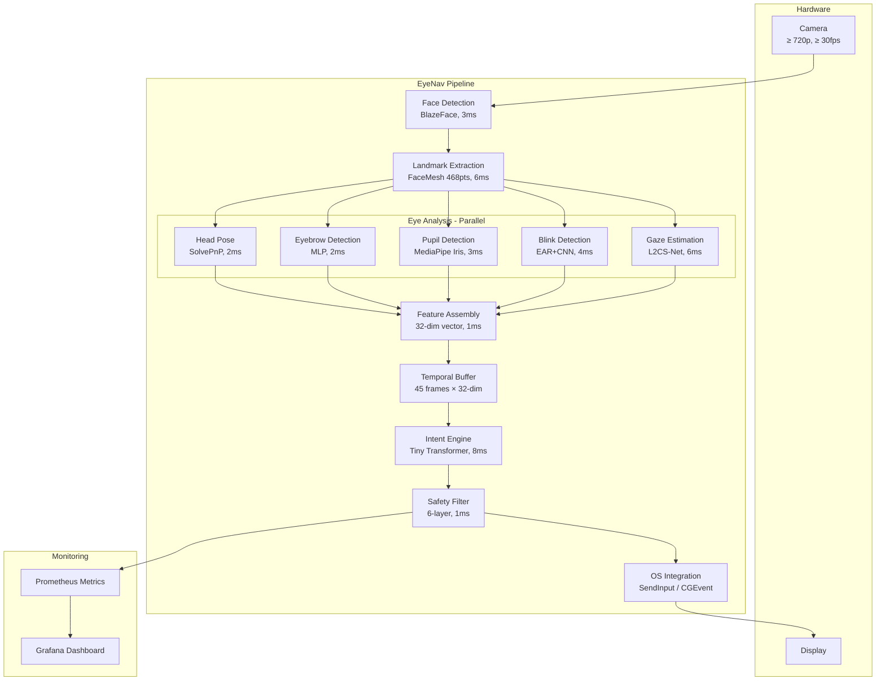
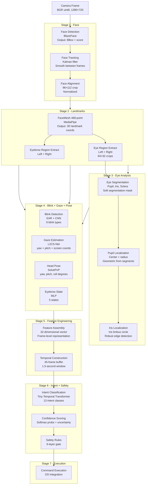
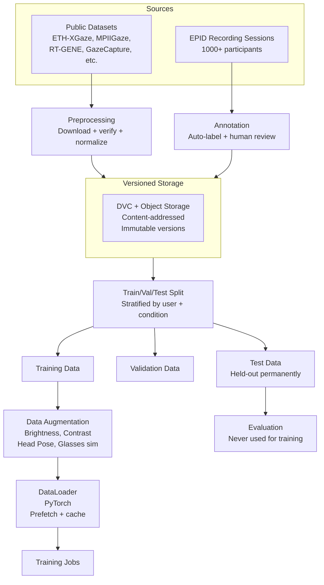
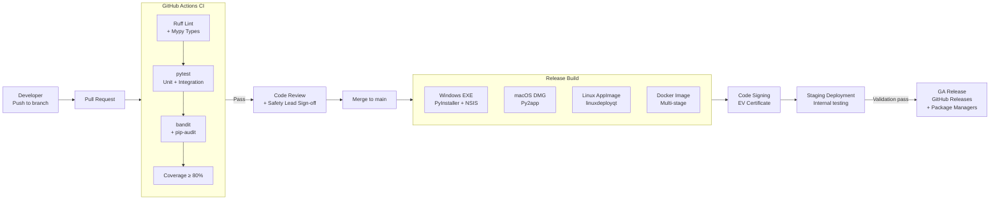
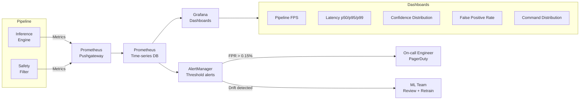
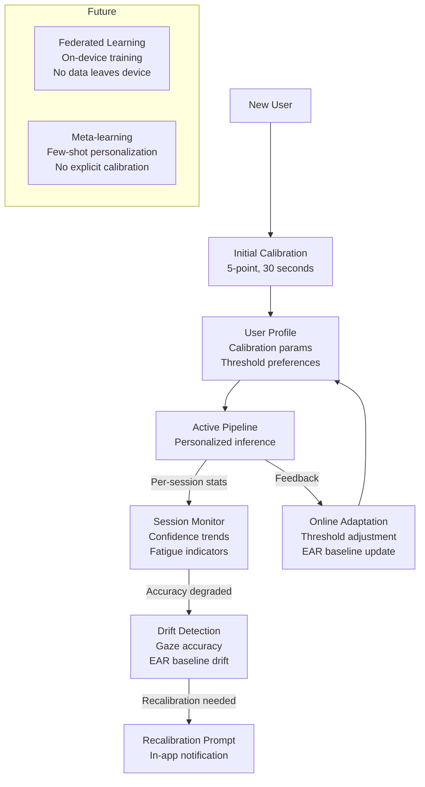

# EyeNav — Pipeline Diagrams

**Document Version:** 1.0  
**Status:** Approved  
**Owner:** Architecture Team  
**Last Updated:** 2024-Q4  

This document contains all requested system diagrams using Mermaid notation.

---

## 1. Overall System Architecture



---

## 2. Vision Pipeline (Stage by Stage)



---

## 3. ML Pipeline

```mermaid
flowchart LR
    subgraph Data
        DS[Datasets\nETH-XGaze, MPIIGaze,\nEPID, RT-GENE...]
        DVC[DVC Data Versioning]
        PP[Preprocessing\nNormalization\nAugmentation\nSplit]
        DS --> DVC --> PP
    end

    PP --> Training

    subgraph Training
        TR[PyTorch + Lightning\nModel Training]
        EX[Experiment Tracking\nMLFlow + W&B]
        CK[Checkpointing\nBest + Last]
        TR --> EX
        TR --> CK
    end

    CK --> Evaluation

    subgraph Evaluation
        EV[Evaluation Harness\nAccuracy + Latency]
        BI[Bias Evaluation\nStrat. by demographics]
        EV --> BI
    end

    BI --> Export

    subgraph Export
        ONNX[ONNX Export]
        QNT[INT8 Quantization]
        VAL[Validation\nPyTorch vs ONNX < 1e-5]
        ONNX --> QNT --> VAL
    end

    VAL --> Registry

    subgraph Registry
        MR[MLFlow Model Registry\nStaging → Production]
        PR[Promotion Policy\n7 criteria must pass]
        MR --> PR
    end

    PR --> Deployment

    subgraph Deployment
        DIST[Model Distribution\nInstaller / DVC / Docker]
        DIST --> Live
    end

    subgraph Monitoring
        Live[Production Inference]
        DR[Drift Detection\nPage-Hinkley test]
        AL[Alert\nFPR, Confidence, FPS]
        Live --> DR --> AL
        AL -->|Retrain trigger| Data
    end
```



---

## 4. Data Pipeline



---

## 5. Deployment Pipeline



---

## 6. Monitoring Pipeline



---

## 7. Feedback Pipeline

```mermaid
flowchart TB
    USER[User Interaction\nReal-world usage]
    USER --> |Commands executed| LOG[Audit Log\nLocal encrypted]
    USER --> |Optional telemetry\n(anonymized, opt-in)| ANON[Anonymization\nDifferential Privacy ε=1.0]
    ANON --> COLLECT[Collection\nTLS 1.3]
    COLLECT --> AGGREGATE[Aggregation\nRemove any PII]
    AGGREGATE --> ANALYSIS[Analysis\nDrift detection\nUser behavior patterns]
    ANALYSIS --> |Insights| PRODUCT[Product Team\nFeature prioritization]
    ANALYSIS --> |Data signals| ML[ML Team\nModel improvement]
    ML --> |New training data| DATASETS[EPID Dataset\nNew batch]
    DATASETS --> |Quarterly retrain| MODELS[Updated Models]
    MODELS --> |Rolling deployment| USER
```

---

## 8. Learning Pipeline (Personalization)


